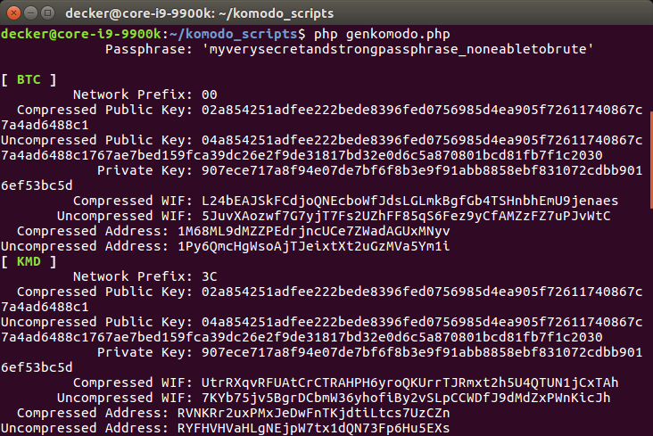

# komodo_scripts

## How to install and use genkomodo.php?

`genkomodo.php` can be used for generate addresses and WIFs (private keys) from Agama / Iguana passphrase for a different coins. Coin params can be taken from `chainparams.cpp` of each coin, for example, for Komodo (KMD) needed params (pubkey_address, script_address, secret_key) located [here](https://github.com/jl777/komodo/blob/master/src/chainparams.cpp#L180). To add new coin in script we just need to fill it [here](https://github.com/DeckerSU/komodo_scripts/blob/411b9036be8dd75ca7ed2460d1c9ba6a0fd599c3/genkomodo.php#L126).

### Installation instructions

Script can be used on any PC, but highly recommended to use separate offline PC for generating WIFs.

```
git clone https://github.com/DeckerSU/komodo_scripts
cd komodo_scripts
git submodule init
git submodule update --init --recursive
sudo apt install php7.2-cli php7.2-gmp php7.2-mbstring
```

### How to run?

```
1. edit genkomodo.php and fill your passphrase instead of $passphrase = "myverysecretandstrongpassphrase_noneabletobrute";
2. php genkomodo.php
3. Write down WIFs and/or addresses taken from your passphrase.
4. Delete your passphrase from genkomodo.php for security purposes.
5. Import taken WIFs to coin daemons.
```

### Example of output:




### FAQ

- **Q.** Where should i find `Keccak256.php` needed by genkomodo.php script?  
  **A.** You don't need to search it in other repoes, just clone this one, as described in installation steps. Repo contains all needed for genkomodo.php work.  
- **Q.** I have a Desktop version of Linux, is any GUI tool with same functionallity provided?  
  **A.** Yes, it's called [address_gen](https://github.com/DeckerSU/address_gen) and have similar functionallity. Note, that php script can be used on server and desktop systems as well, but address_gen tool is only for desktop systems. Don't try to run it on server without gui installed.

## Run php scripts using docker

```
./docker_run.sh genkomodo.php
```
## Other scripts short description

| Script | Description |
| --- | --- |
| ... | ... |