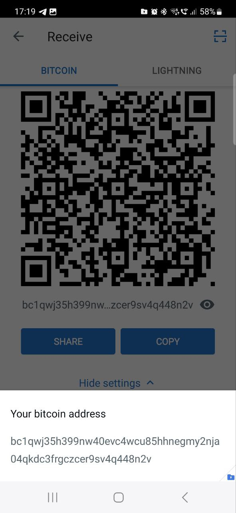
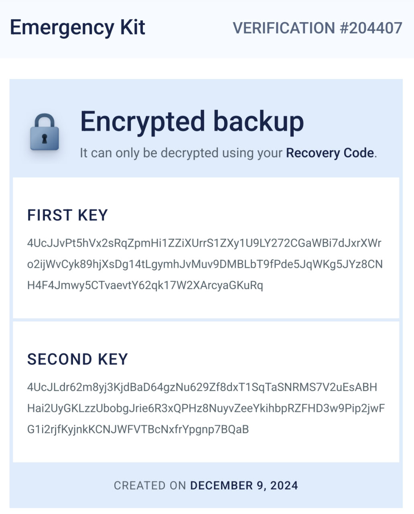

### How to Access Private Keys for Addresses from the Muun Wallet?

Sometimes, you might need to access the private keys corresponding to specific addresses in the Muun Wallet. Why? There are various reasons. For standard "funds sweeping"—moving all funds from the Muun Wallet to an external address—the [Muun recovery tool](https://github.com/muun/recovery) works well. However, what if you need access to the private keys for a specific purpose? This guide explains how to extract private keys using a Muun Wallet backup.

Since this method uses third-party libraries, such as `pycoin` for Python, and involves entering your `xprv` (private) keys into these tools, I strongly recommend doing this on an offline machine or only after transferring all funds out of your Muun Wallet. Additionally, do not reuse this wallet afterward for security reasons.

### Step 1: Install the Muun Wallet and Obtain the Native SegWit Address

First, install the Muun Wallet and retrieve the native SegWit address. For example:



In this case, the native SegWit address is:

```
bc1qwj35h399nw40evc4wcu85hhnegmy2nja04qkdc3frgczcer9sv4q448n2v
```

Next, let's obtain its private keys. Start by creating a wallet backup. Instead of using email, proceed with a recovery code. For this example, the recovery code is:

```
LAX9-FCFR-BNKC-ZT5Z-BD2K-DR7C-L7X4-F2RL
```

**Important:** Never share this recovery code or any other sensitive wallet data with anyone, as it can lead to the loss of all your funds. In this guide, the code is shared only for demonstration purposes, and this wallet will not be used again.

### Step 2: Generate an Emergency Kit

To extract the required keys, create an emergency kit. This will provide the FIRST KEY and SECOND KEY, which are needed to obtain the `xprv` values. Here's an example:



**First key:**

```
4UcJJvPt5hVx2sRqZpmHi1ZZiXUrrS1ZXy1U9LY272CGaWBi7dJxrXWro2ijWvCyk89hjXsDg14tLgymhJvMuv9DMBLbT9fPde5JqWKg5JYz8CNH4F4Jmwy5CTvaevtY62qk17W2XArcyaGKuRq
```

**Second key:**

```
4UcJLdr62m8yj3KjdBaD64gzNu629Zf8dxT1SqTaSNRMS7V2uEsABHHai2UyGKLzzUbobgJrie6R3xQPHz8NuyvZeeYkihbpRZFHD3w9Pip2jwFG1i2rjfKyjnkKCNJWFVTBcNxfrYpgnp7BQaB
```

### Step 3: Modify and Use the Muun Recovery Tool

Clone the Muun Recovery Tool repository from GitHub:

```
git clone https://github.com/muun/recovery
```

Make small changes to the `main.go` file to output the keys. Add the following lines:

```go
fmt.Printf("UserKey: %+v\n", decryptedKeys[0].Key)
fmt.Printf("MuunKey: %+v\n", decryptedKeys[1].Key)
```

Insert these lines before the following code block:

```go
addresses := addrGen.Stream()

sweeper := Sweeper{
    UserKey:      decryptedKeys[0].Key,
    MuunKey:      decryptedKeys[1].Key,
    Birthday:     decryptedKeys[1].Birthday,
    SweepAddress: destinationAddress,
}
```

Now, build and run the `recovery` tool, answering all the prompts with the data from above. It will output two keys before it begins scanning addresses.

```
UserKey: xprv9s21ZrQH143K2scgAKadJkpcMHGsjyeYZrmZpHxzHEgyHUH3W8XrL54GpMSPzmhkGYAJEHzANFtdJ6BgkXGt8uAKUzjfVzPBjZnwK7VMHhD
MuunKey: xprv9s21ZrQH143K3EVNKGfL24khbPNqHxjGmh3YrFY8hyBvhY6oSy699tEQDVqbiXhJXzPNfrKJ41b2N5UNYn33PxXMR9DqWDhF931ZARYfHkx
```

### Step 4: Obtain addresses and privkeys

That's exactly what we need. Each Muun address is a 2-of-2 multisig derived from these BIP-32 private keys. Now, let’s proceed. Using the `bip32_muun.py` tool from this repository, which is based on the [pycoin](https://pypi.org/project/pycoin/) library, we’ll enter the required values from above, set `addresses_type = "external"` for external addresses (i.e., not change addresses), and generate the first five external addresses. The output will look as follows:

```
User BIP32 Extended Private Key (xprv): xprv9uBC8rJT9UDoseq1Ynzrme2GbJ3avDSZTbR93BDhCiWtofXYgsVxSRY463rt7yKQ5pbJp35fMabaLC5r6XjAHNyvnRZVvWf3S3EKsTKYQGo
Muun BIP32 Extended Private Key (xprv): xprv9zAKKXaLEXLcvxMcaToc29sGUFZRFyS9ihsMVQvDRsXLWyW6Qvri2dFjfuFCdStraCq9BPfJE1xqHKv4toZvDmntXU8LF5WdDXKxzKcio5b
Path		Address				Public Key (hex)				Private Key (WIF)
---------------------------------------------------------------------------------------------------------
0	bc1qwj35h399nw40evc4wcu85hhnegmy2nja04qkdc3frgczcer9sv4q448n2v	(025fcdae5486c90b9049b9e08b710bf74cc61e216a0c150645ffdcebdf941008d0,022fcdaad6709353aaebe4baddda543e2d47d98dddea78b39aa366ecf5635866ed	(KzvFDrhJnZGyo9B1AUTJnecaL32zz7NRVWEGCJWV5uini16eSA9J,KyvxpMXW96Y39SbnGRGzarM3ukL8NXyXG1QNemCfEs8x4w2GANRr))
1	bc1qwgls3ykzsn7g5wral2qf8z8jpfjd93c2ukdh4qpqtsqw952gn8jsyfp9yt	(0380823cd3ed8054d18b8be48fd77579b4aacc044c4db4354780402514329ae1e0,0363eca581cf85443b38bcef512672255ecc87368d96cabd9b13fb513ba567eed0	(L2bSsBaqxrGHMuBPbcn1yKwtuGD2HRyAvpG8Z4KviLhE4Pz5fPdS,KyfxWzojdQ15Qv5FDjS96zUvXpQDPC5tFyWFEFbLg1GArPLSTn5v))
2	bc1qwuveqpvaq8guqteagfza9eyr5nr4fq20f3l56mswyzknq6pr4d2s295uex	(032315ccd3148aac714b53b375723049116d2691c92b1606905302abc7b72d6eed,030105df9d94ec303510a703a24a065026c6e94ac707803960d01209f11e12684b	(KyzbLYwRHuZ1tKreZEbRLWXqCTaZ7DgRwq665Svn2MCQ7yGkyEf3,L3eAqG9LPUmDZ7NBnx6jTW3ydr4ko8ptoMNttsKUcPkydjLoqrG2))
3	bc1qmghdhe253ty59rgrkervgew5g6sq6uz00np2fur09u6z0aawy8fs8293sg	(021b0dcb9b7fd60655d705bc3783d1bcda04a5517edb72eb8b158dd8efa13d9807,035bc7f69098af414afcf68a6c09de8028ce6227ee7a996831719cfc7ac1c8ab3a	(L5DcdC1keUHC7wWgh4aRvVXMhUrP2xKHBvgdYf27G1cUhhTT86Zo,KxE1mGzUgcjroSEZsUenbSYo46QJh5EsUxykDSen8xKprWhTdrGH))
4	bc1q0yxp0chusfkzk9gdlltmz4p06kqd358rm4gwzsghnqraw8s7pjeqw5aq83	(0281f7dbb19c4d4f88a0a1dd05e9ae4bd224842ea5686ae35f481bcf62cc105e16,02039d87df4fd0d08cfd13711b598cebb3d6e7ab89b03d0d2b2338a6a4343d8d27	(L12saRrbEzWFARS7DnbhwW5tdpy4mWvHjEqt2UCdSJqNxLZi9Vx1,Kx9NREZSG9adR3vyptz6p1ueVt6YQ1BbmjWxYRufPANaEs84rtDg))
```

Here, we can see that our address `bc1qwj35h399nw40evc4wcu85hhnegmy2nja04qkdc3frgczcer9sv4q448n2v` is listed as a 2-of-2 multisig address derived from the public keys `(025fcdae5486c90b9049b9e08b710bf74cc61e216a0c150645ffdcebdf941008d0, 022fcdaad6709353aaebe4baddda543e2d47d98dddea78b39aa366ecf5635866ed)` with the corresponding private keys `(KzvFDrhJnZGyo9B1AUTJnecaL32zz7NRVWEGCJWV5uini16eSA9J, KyvxpMXW96Y39SbnGRGzarM3ukL8NXyXG1QNemCfEs8x4w2GANRr)`.

By the way, you might be interested in reading Muun’s blog post, [Self-Custody in Muun: Why Not Just a Mnemonic?](https://blog.muun.com/why-not-just-a-mnemonic/), which explains why they use this "complex" recovery scheme (though it’s not actually that difficult).

Now that we have the private keys for the address, we can try importing them into a wallet, such as Bitcoin Core `v25.2.0`. Open Bitcoin Core `v25.2.0`, create a non-descriptor wallet, and navigate to the Console. Then issue the following commands:

```
importprivkey "KzvFDrhJnZGyo9B1AUTJnecaL32zz7NRVWEGCJWV5uini16eSA9J" "" false
importprivkey "KyvxpMXW96Y39SbnGRGzarM3ukL8NXyXG1QNemCfEs8x4w2GANRr" "" false
# getdescriptorinfo, https://bitcointalk.org/index.php?topic=5475186.0
# importdescriptors "[{\"desc\": \"wpkh(KzvFDrhJnZGyo9B1AUTJnecaL32zz7NRVWEGCJWV5uini16eSA9J)#s3aldpzg\", \"timestamp\": 0}]"
# importdescriptors "[{\"desc\": \"wpkh(KyvxpMXW96Y39SbnGRGzarM3ukL8NXyXG1QNemCfEs8x4w2GANRr)#6cjheupc\", \"timestamp\": 0}]"
createmultisig 2 '["025fcdae5486c90b9049b9e08b710bf74cc61e216a0c150645ffdcebdf941008d0", "022fcdaad6709353aaebe4baddda543e2d47d98dddea78b39aa366ecf5635866ed"]' bech32
addmultisigaddress 2 '["025fcdae5486c90b9049b9e08b710bf74cc61e216a0c150645ffdcebdf941008d0", "022fcdaad6709353aaebe4baddda543e2d47d98dddea78b39aa366ecf5635866ed"]' bech32
getaddressinfo bc1qwj35h399nw40evc4wcu85hhnegmy2nja04qkdc3frgczcer9sv4q448n2v
```

The output should be like this:
```json
{
  "address": "bc1qwj35h399nw40evc4wcu85hhnegmy2nja04qkdc3frgczcer9sv4q448n2v",
  "scriptPubKey": "002074a34bc4a59baafcb31576387a5ef3ca36454e5d7d4166e2291a302c6465832a",
  "ismine": true,
  "solvable": true,
  "desc": "wsh(multi(2,[089f9767]025fcdae5486c90b9049b9e08b710bf74cc61e216a0c150645ffdcebdf941008d0,[07f2dfaa]022fcdaad6709353aaebe4baddda543e2d47d98dddea78b39aa366ecf5635866ed))#974awwp6",
  "iswatchonly": false,
  "isscript": true,
  "iswitness": true,
  "witness_version": 0,
  "witness_program": "74a34bc4a59baafcb31576387a5ef3ca36454e5d7d4166e2291a302c6465832a",
  "script": "multisig",
  "hex": "5221025fcdae5486c90b9049b9e08b710bf74cc61e216a0c150645ffdcebdf941008d021022fcdaad6709353aaebe4baddda543e2d47d98dddea78b39aa366ecf5635866ed52ae",
  "sigsrequired": 2,
  "pubkeys": [
    "025fcdae5486c90b9049b9e08b710bf74cc61e216a0c150645ffdcebdf941008d0",
    "022fcdaad6709353aaebe4baddda543e2d47d98dddea78b39aa366ecf5635866ed"
  ],
  "ischange": false,
  "labels": [
    "bech32"
  ]
}
```

And here it is—our address is now in the Bitcoin Core wallet.


