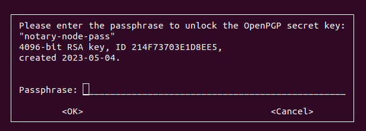

## How to secure iguana password? ##

Current manuals, such as [Setup Komodo Notary Node](https://docs.komodoplatform.com/notary/setup-Komodo-Notary-Node.html#setup-iguana) documentation, recommend storing the iguana password as plain-text in the `wp_7776` file, which can be insecure as any application potentially could read it. In this manual, we will try to secure the password storage using the GnuPG tool.

1. First of all create `~/gpgparams` file with following content:

```
%echo Generating a basic OpenPGP key
Key-Type: RSA
Key-Length: 4096
Name-Real: notary-node-pass
Passphrase: abc
Expire-Date: 0
%commit
%echo done
```

Where `abc` will be your passphrase to access the encrypted iguana seed (not the seed itself), you can do so with the following command:

```
cat <<EOF > ~/gpgparams
%echo Generating a basic OpenPGP key
Key-Type: RSA
Key-Length: 4096
Name-Real: notary-node-pass
Passphrase: abc
Expire-Date: 0
%commit
%echo done
EOF
```

If you don't want to use a password to access a seed (not secure) change `Passphrase: abc` string on `%no-protection`.

2. Generate GnuPG key:
```
gpg --generate-key --batch ~/gpgparams
```
It will generate a basic OpenPGP key and store it in the GnuPG default keyring (`~/.gnupg` directory). You can list stored OpenPGP secret keys with `gpg -K`. Do not launch the generate key command twice, as it will generate a second OpenPGP secret key with the same "name".

3. Encrypt your iguana seed with:
```
echo -n "YOUR_VERY_SECURE_PASSPHRASE" | gpg --encrypt -o ~/encrypted-pass.gpg -r notary-node-pass
```
The encrypted seed will be stored in `~/encrypted-pass.gpg` file.

4. Create the `wp_7776` file with the following lines:
```
curl --url "http://127.0.0.1:7776" --data "{\"method\":\"walletpassphrase\",\"params\":[\"$(gpg --quiet --for-your-eyes-only --no-tty --decrypt ~/encrypted-pass.gpg)\", 9999999]}"
```

5. Now when you will start `m_notary_main` or other script which calls `wp_7776` inside, you will see the following password prompt to unlock an iguana seed:



Enter the passphrase to continue script execution.

